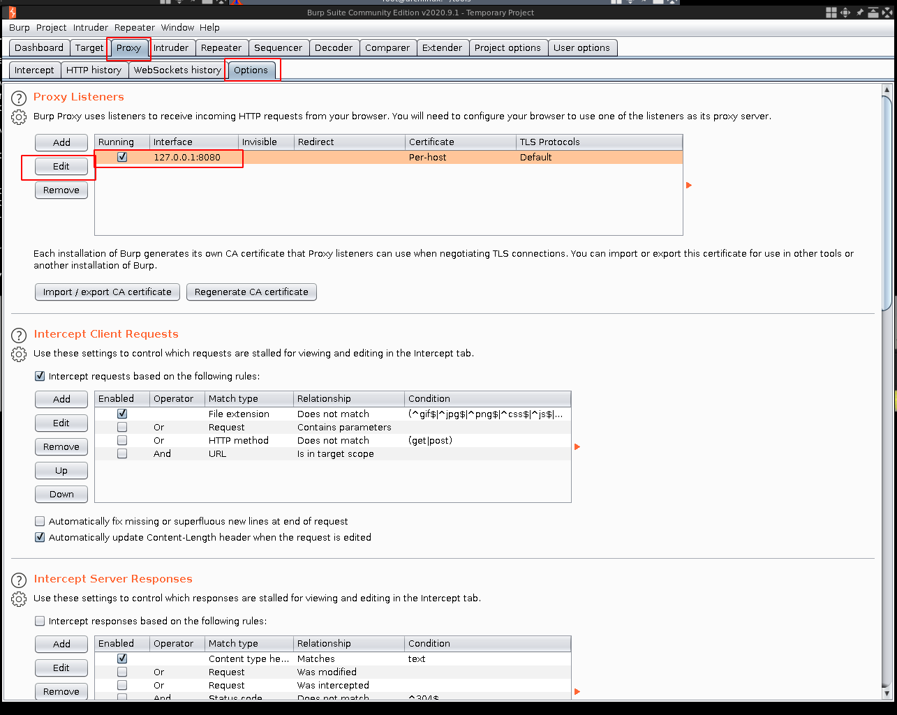
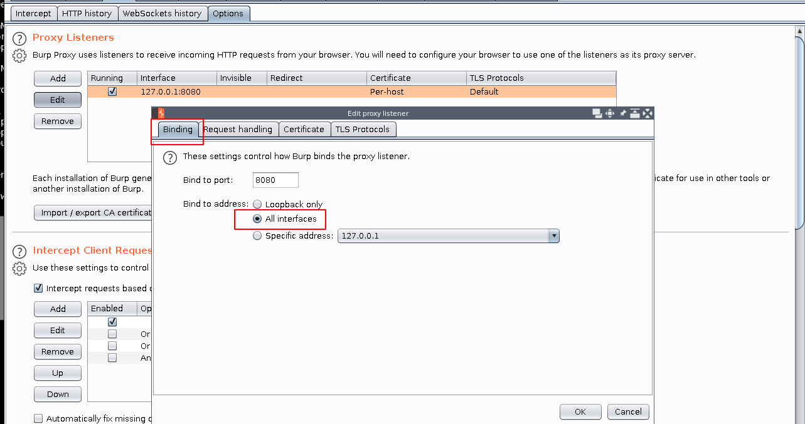
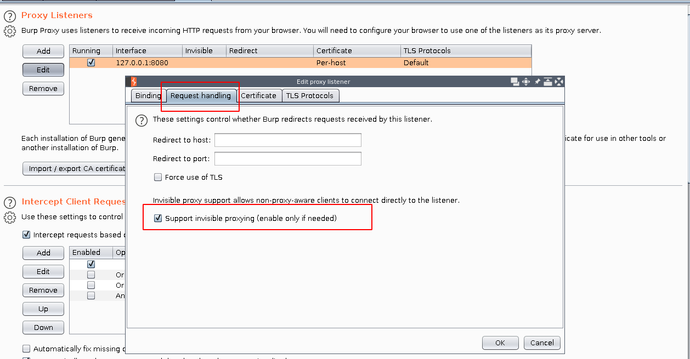
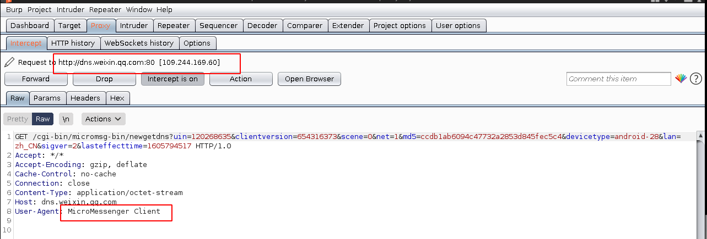
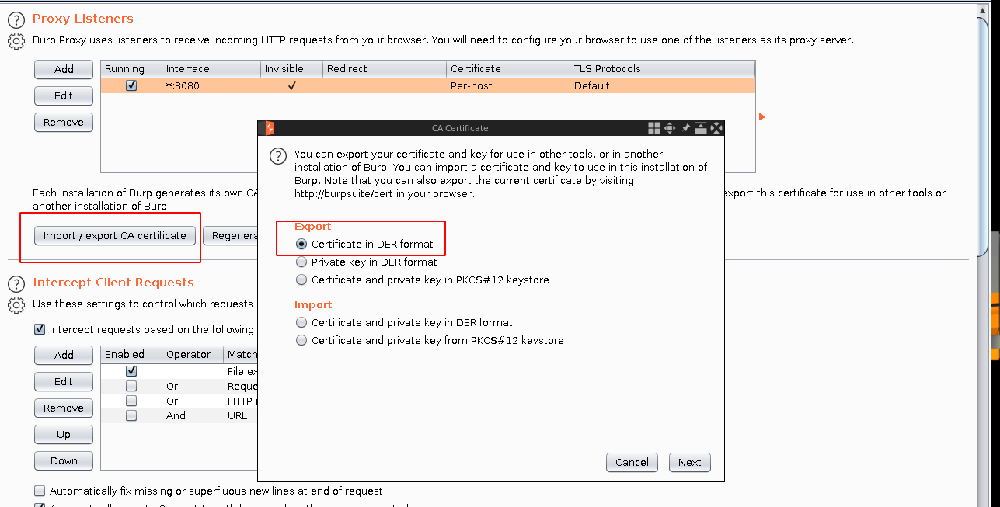

# kali_wifihack-抓包平台

参考：

doc_201119_移动安全-APP逆向-针对常见反抓包手段对抗.md： 非常骚的操作思路，动用安卓的iptables

doc_201119_kali搭建钓鱼WiFi_hostapd_dnsmasg.md

doc_201119_Kali_linux搭建钓鱼wifi_airbase-ng.md

doc_201119_kali使用Fluxion钓鱼WiFi.md


***

## 使用双无线网卡共享wifi-实现burpsuite的透明代理http和https

最近在搞汽车ivi设备的渗透测试，发现有些车辆ivi设备的网络设置没有配置代理服务器的地方（基本手机都有），同样针对https导入证书，同样厂家也是把安卓“设置”中基本的证书导入功能阉割了。于是有个想法，那笔记本做一个wifi网关，然后能不能实现透明http代理进行抓包。这样笔记本、汽车、手机等连接wifi的移动设备，不用设置代理就可以进行wedb抓包的分析。岂不是很爽，参考几个大佬文章后，感觉可行度比较高。

**另外，为方便外出抓包，经常抓车，放不到办公室。所以外网口和内网口都用无线网卡，用起来方便啊。**

先看看之前大佬的智慧：

* https://blog.bbskali.cn/2179.html：主要学习实现wifi网关
* https://blog.bbskali.cn/2179.html：绝对大佬，后续按照hook思路，继续深入解析数据包。安卓端数据包重定向，burp透明代理功能
* https://blog.csdn.net/hulifox007/article/details/3706729：可行性论证，但没方法，我也不熟悉iptables
* https://blog.csdn.net/weixin_33963189/article/details/92352944：大佬直接干货，没废话

总结下：

* 实现wifi共享，做nat共享上网
* 了解透明代理，恰好burp有透明代理姿势
* iptables神器和网络知识，关于路由表和数据包修改（nat，redirect）的先后，数据包路由原理
* 安卓https证书adb导入（阉割功能的）


共享wifi参考说的很明白，很好不在多说了。

1. burpsuite的透明代理配置：（大佬原文也讲很清晰）

   修改burp代理设置，原配置只监听127.0.0.1接口，所以明白的

   

   可以具体设置内网端wifi接口ip，这里我监听所有口了：

   

   然后，很重要，开启透明（invisiable英文重要）代理模式，可以试试，如果这个模式不开，能访问burp，得不到response：

   

   burp配置比较简单。

2. 启动wifi共享，参照自己网络参数配置：

   ```
   封装一个脚本：start_wifi.sh
   airmon-ng start wlx00e05c30a11f
   ip link set wlan0mon up
   ip addr add 192.168.100.1/24 dev wlan0mon
   route add -net 192.168.100.0 netmask 255.255.255.0 gw 192.168.100.1
   hostapd hostapd.conf &
   dnsmasq -C dnsmasq.conf -d &
   bash config_iptables.sh
   #注意查看防火墙规则，尤其设备有docker要注意。docker规则会影响nat，具体还没时间分析
   ```

3. 配置iptables把wifi内网网段80和443的流量重定向到burp的8080口，当然也可以另外一台机器的burp。

   ```
   这个也可以封装到脚本：
   iptables -t nat -A PREROUTING -s 192.168.100.0/24 -i wlan0mon -p tcp -m tcp --dport 80 -j REDIRECT --to-ports 8080
   iptables -t nat -A PREROUTING -s 192.168.100.0/24 -i wlan0mon -p tcp -m tcp --dport 443 -j REDIRECT --to-ports 8080
   ```

   然后检查下iptables：(主要看filter表和nat表)

   ```
   root@mykali:~/wifi_phish# iptables -t nat -L
   Chain PREROUTING (policy ACCEPT)
   target     prot opt source               destination         
   REDIRECT   tcp  --  192.168.100.0/24     anywhere             tcp dpt:http redir ports 8080
   REDIRECT   tcp  --  192.168.100.0/24     anywhere             tcp dpt:https redir ports 8080
   
   Chain INPUT (policy ACCEPT)
   target     prot opt source               destination         
   
   Chain POSTROUTING (policy ACCEPT)
   target     prot opt source               destination         
   MASQUERADE  all  --  anywhere             anywhere            
   
   Chain OUTPUT (policy ACCEPT)
   target     prot opt source               destination  
   
   root@mykali:~/wifi_phish# iptables -t filter -L
   Chain INPUT (policy ACCEPT)
   target     prot opt source               destination         
   
   Chain FORWARD (policy ACCEPT)
   target     prot opt source               destination         
   ACCEPT     all  --  anywhere             anywhere            
   
   Chain OUTPUT (policy ACCEPT)
   target     prot opt source               destination     
   ```

   iptables不熟悉，理解iptables机制和操作花费不少时间，菜鸡。

4. 可以看到burp上好多http的包，浏览器的、app的开心啊，相当全局代理。

   

   用的全新干净的debian做的，没处理burp字体。看手机qq通信包被抓。我的Nokia

   

   微信的通信（后边连扫码登录都拿到了）

5. 配置https：（吐槽现在chromium导入证书真费劲，firefox很友好）

   burp导出证书，本地导出和浏览器下载都行：

   

   导出：

   

6. 使用adb导入安卓，一般方式adb push 到安卓的/sdcard，然后用“设置”的证书导入。但是我的车机阉割版，没有证书导入。

   参考：

   * https://blog.csdn.net/winceos/article/details/32130655
   * https://blog.csdn.net/u011975363/article/details/83654074
   * https://www.cnblogs.com/liuqiyun/p/12488845.html

   希望：

   * https://blog.csdn.net/jlvsjp/article/details/78018393

   准备试试adb启动证书安装：

   ```
   adb shell am start -n com.android.certinstaller/.CertInstallerMain -a android.intent.action.VIEW -t application/x-x509-ca-cert file:///sdcard/cacert.cer
   ```

   证书在：`AOSP Android系统中CA证书文件的位置在：/ system/etc/security/cacerts/一系列的以数字命名的.0文件`

   参卡：

   ```
   首先看Android 4.x 系统的证书存放位置：
   AOSP Android系统中CA证书文件的位置在：/ system/etc/security/cacerts/一系列的以数字命名的.0文件
   
   方法一：
   Android 4.0 已经支持用户安装根证书了，只需要将根证书放到sdcard根目录，然后到设置(Settings) – 安全(Security) – 从存储设备安装(Install from storage)就可以了，但是这样安装需要设置锁屏PIN或密码才可以。
   但是，该操作需要每次打开手机输入锁屏PIN或密码，为用户带来很大的麻烦。
   
   方法二：（注意：需要Root 权限才可以）
   手机获取Root权限后，直接把Base64文本格式的根证书文件复制到etc/security/cacerts文件夹里，然后到设置(Settings) – 安全(Security) – 受信任的凭据(Trusted credentials)里面，此时你要安装的根证书应该会显示已经安装好了。这样安装之后根证书是作为系统证书使用的，而不是按照方法一安装方式的用户证书。
   如果要删除就把文件夹里面的根证书文件删掉或者直接把证书后面的勾去掉就行了。
   ```

   但是，直接强制adb push过去没用的，readonly，或许能搞到ssh不知道行不行？

   ```
   [root@archlinux ~]# adb push burp.cer   /system/etc/security/cacerts/
   burp.cer: 1 file pushed, 0 skipped. 3.1 MB/s (940 bytes in 0.000s)
   adb: error: failed to copy 'burp.cer' to '/system/etc/security/cacerts/burp.cer': remote Read-only file system
   ```

   所以，证书只能push到/sdcard/：(常规操作，我的车机奇葩，只能访问/sdcard，内部/dada什么的通过屏幕访问不到！！)

   ```
   [root@archlinux ~]# adb push burp.cer   /sdcard
   burp.cer: 1 file pushed, 0 skipped. 2.0 MB/s (940 bytes in 0.000s)
   ```
   **明天去单位试试 adb启动证书安装的大招，看看是不是这个也被阉割**

   **PS：** chromium 导入cert最靠谱一个，国外大佬：https://www.youtube.com/watch?v=rPz9uYmt_xo
